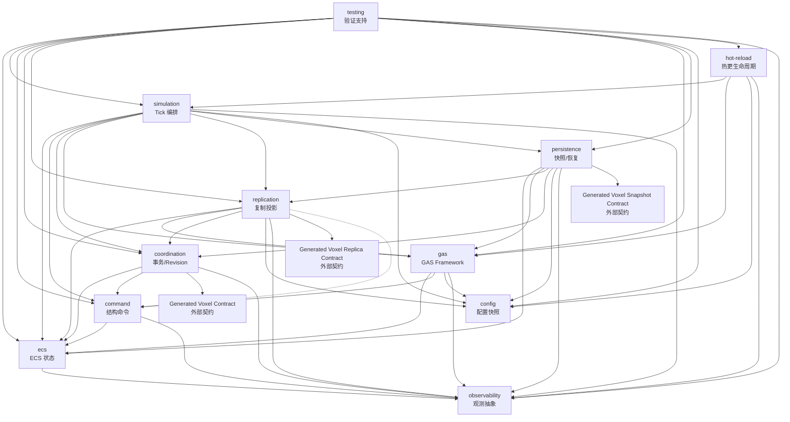

# LumioGameRuntime 模块架构（模块总入口）

> **架构基线**：`LGE-V1.4-2026-08-27`
> **唯一架构源**：`LumioGameEngineArchitecture`（本仓只保存只读镜像 [docs/architecture/LumioGameEngine_Architecture_v1.4.md](../docs/architecture/LumioGameEngine_Architecture_v1.4.md)）
> **本文定位**：LumioGameRuntime 的模块文档总入口。公共语义引用架构源，本文只定义本仓的模块边界、依赖方向、状态所有权、线程/队列约束和文档维护规则。

## 1. 设计目标、范围与审核结论

### 1.1 设计目标

- 把根 [README.md](../README.md) 声明的 Runtime 能力拆成**状态所有者唯一、依赖单向、可独立测试、故障边界清晰**的模块。
- 让开发者只阅读一个模块 README 就能回答：模块负责什么、不负责什么、拥有哪些状态、接受哪些输入、在哪个执行上下文运行、失败如何分类和恢复。
- 为 Foundation 阶段的 C#/.NET 工程落地提供一对一的逻辑模块地图；物理项目、程序集和目录可以在不改变边界的前提下演进。

### 1.2 范围

- 本目录覆盖 LumioGameRuntime 的一等逻辑模块；每个模块一个目录，目录内的 `README.md` 是该模块的边界契约。
- 当前阶段只补充目录和 Markdown 文档，不包含 C# 工程、源代码、配置、生成器或测试实现。
- 模块 README 描述设计现状，不是新的公共 ABI、Wire Schema、Mapping Schema 或持久化格式来源。

### 1.3 当前架构审核结论

1. **总体方向可进入模块化设计阶段**：Runtime 的 World、Logical Tick、Coordinator、Replication、GAS、Persistence 和 Hot Reload 所有权与架构源 §2、§3、§4、§6、§7、§9、§11、§13 一致。
2. **架构源的清单是仓库级粗粒度，根 README 允许实现粒度细化**：`command` 与 `testing` 在架构源 §16 的 Runtime 表中没有单独列出，本仓将它们明确为独立边界；这不新增公共语义，也不改变 Runtime 的仓库所有权。
3. **`simulation` 是 Tick 编排模块，不是 Host 时钟模块**：Host 决定何时调用入口，Runtime 只拥有 Logical `TickId`、Phase Graph、Processor 计划和确定性规则。
4. **`coordination` 是 CrossWorldTxnV1 与 Revision 的唯一语义所有者**：`persistence` 只负责记录、编码和恢复编排，不能复制事务状态机或另造 Revision。
5. **`replication` 拥有投影、Mapping、Baseline/Delta History 和 Apply 语义，Transport 不在本仓**；Server/Client 只提供适配器，LocalEmbedded 仍必须经过完整契约路径。
6. **GAS 与 ECS 采用单一真相**：`gas` 保存框架索引和瞬时执行上下文，权威可复制状态投影回 ECS；Game 负责具体 Formula、Cost、Cooldown、Targeting 和表现事件。
7. **持久化与观测必须分离**：Snapshot/WAL/Command Log 是恢复输入，Diagnostic/Audit/Metrics/Trace/Failure Bundle 是观测产品，不能用日志替代恢复日志。
8. **`hot-reload` 只拥有 Gameplay ModuleScope 资源登记和卸载协议**：CoreCLR/ALC 创建由 Host 负责，Runtime 不创建进程或运行时，也不把热更资源泄漏转成普通业务错误。
9. **当前没有实现工程**：所有接口名、目录映射和性能数字均为边界设计；未在架构源发布的字段、错误码、枚举和布局不得在这里冻结。

## 2. 系统上下文与仓库边界

LumioGameRuntime 是七仓库体系中的稳定 C# ECS Runtime（架构源 §2.1）：

- **本仓拥有**：每个 Role/World 的 ECS Storage、Entity/Component、Query、CommandBuffer、Logical Tick/Phase、Coordinator、Replication 语义、GAS Framework、Snapshot Cut 接口、Config Snapshot、统一观测抽象和 Gameplay ModuleScope 契约。
- **Host 拥有**：Server/Client 进程、Wall Clock、Connection、CoreCLR/ALC 创建、Renderer、Release Pool 和生产运维；本仓只消费 Host Tick 入口和 Capability。
- **VoxelEngine 拥有**：VoxelWorld、Chunk、Block、World/Chunk Revision 和内部 Streaming；本仓只能通过版本化 `IVoxelWorldPort`/Generated Contract 访问。
- **Game 拥有**：具体 Component/Processor 内容、GAS Formula/Cost/Targeting、Mapping 内容、Config/Content、Scenario 和业务 Migration Hook。
- **编译依赖**：`LumioGameRuntime -> Generated Native/Voxel Contracts`；不依赖 Server、Client、Game 或 Voxel 实现源码。第三方库只经 Adapter 进入稳定 API。
- **运行时加载**：`Server/Client Host -> stable Runtime -> role-specific World -> Gameplay Assembly -> Voxel Port/GAS/generated contracts`。

所有模块都必须遵守以下全局约束：

1. Server 与 Client 使用独立 World、Storage、LocalEntityId 和 Gameplay Assembly；LocalEmbedded 也不能共享对象引用。
2. 权威状态只在 Simulation Owner Thread 和规定的 Tick Barrier 提交；异步结果先进入有界队列，再由 Barrier 应用。
3. Runtime 不读取 Wall Clock，不直接操作 Socket、Connection、Renderer 或 Voxel 内部 Storage。
4. 公共字段、状态、错误、时序、ID 和版本只从架构源生成物消费；模块 README 不复制第二套定义。
5. 所有队列、批次、历史窗口和资源租约都有上限、满载动作、取消语义和 Metrics；禁止无界增长。

## 3. 模块地图与依赖方向

### 3.1 模块地图

| 模块 | 一句话职责 | 层 | 首批状态 |
| --- | --- | --- | --- |
| [ecs](ecs/README.md) | World-local Entity、Component、Query、Storage 和 Change Tracking | 基础状态 | P0 |
| [simulation](simulation/README.md) | Logical Tick、13 相 Phase、Processor 调度和 Determinism | 执行编排 | P0 |
| [command](command/README.md) | CommandBuffer、Deferred Token、稳定合并和结构提交 | 执行原语 | P0 |
| [coordination](coordination/README.md) | CrossWorldTxnV1、Reservation、Revision Vector 和 SnapshotCut | 状态协调 | P0 |
| [replication](replication/README.md) | Projection、Mapping、Baseline/Delta History、Apply 和 Dirty Set | 状态投影 | P0 |
| [gas](gas/README.md) | Ability/Effect/Attribute/Tag Framework 和 Prediction Context | 领域框架 | P1 |
| [persistence](persistence/README.md) | Snapshot/WAL、Canonical Encode/Decode 和恢复协作 | 持久化 | P1 |
| [config](config/README.md) | Schema 编译表、层级合并和不可变 Tick ConfigSnapshot | 配置基础 | P1 |
| [observability](observability/README.md) | Event、Metrics、Trace、Audit 和 Failure Bundle 抽象 | 观测基础 | P1 |
| [hot-reload](hot-reload/README.md) | GameplayModuleScope、Quiesce/Cancel/Drain/Unload 协议 | 生命周期 | P1 |
| [testing](testing/README.md) | Reference Host、Replay/Hash、Scenario Adapter 和故障注入 | 验证支持 | P1 |

“首批状态”表示实现优先级，不表示代码已经存在或已经交付。

### 3.2 依赖三视图

模块间关系分三种视图分别维护，不得从一种视图推断另一种：

1. **Assembly/编译依赖 DAG**（本节图）：`A -> B` 表示 A 的程序集消费 B 的契约，必须严格无环。
2. **运行时调用方向**：Simulation 编排下游、Host 回调入队、Worker 返回 Completion；见 §4.1 Tick 主链，它可以与编译依赖不同。
3. **状态所有权**：哪个模块持有可变真相；见 §3.3，不能从「谁调用谁」推断。

Assembly/编译依赖 DAG 的归属规则：Port 契约类型（Journal Port、Observability Event Port、Voxel Port、TickContext、Replication confirmation 类型等）按「调用方或中立 generated-contract 程序集」归属，具体实现由 Composition Root 注入。例如 `coordination` 消费的耐久 Journal Port 契约不得定义在 `persistence` 程序集内，避免 `coordination <-> persistence` 编译环。基础模块不得依赖上层编排模块；`testing` 只能被测试工程消费，生产模块不得反向依赖它。



图注：实线为编译期契约依赖；虚线 `replication -.-> command` 为仅逻辑消费边——`replication` 消费已确认命令序号，确认序号类型按中立 generated-contract 归属，不形成 Assembly 直接引用。`replication -> Generated Voxel Replica Contract` 与 `persistence -> Generated Voxel Snapshot Contract` 是外部生成契约边，Runtime 不依赖 VoxelEngine 实现源码。

补充约定：

- `simulation` 是 Runtime 内的 Tick 编排边界，但不是一个可以被所有模块反向调用的全局单例；它通过值对象和接口调用下游模块。
- 对外的 `SimulationSession` 生命周期 Facade 由 `simulation` 组装；其中 Revision、Txn、Reservation 和 SnapshotCut 状态委托给 `coordination`，不形成两份真相。
- `observability` 和 `config` 是只读基础依赖：模块可以发事件或读取当前快照，但二者不能回调业务模块改变权威状态。
- `coordination` 只协调 Runtime GameWorld 与 `IVoxelWorldPort`；它不复制 Voxel Storage，也不把 Host 的持久化实现塞进事务锁内。
- `replication` 可以消费 GAS/Coordination 的投影接口，但 Transport ACK、Socket、连接生命周期和 Endpoint 归 Host。
- `persistence` 只消费各模块提供的稳定 Snapshot/Replay Provider；它不能反向改变 Tick、World 或 Config 的所有权。
- `hot-reload` 通过 Scope/Lease/Hook 与 Runtime 交互，不允许 Gameplay Assembly 持有未经登记的 Task、Timer、Native Handle 或回调。

### 3.3 状态所有权

| 状态或资源 | 唯一所有者 | 边界说明 |
| --- | --- | --- |
| LocalEntity、Component Storage、Query View、Change Set | `ecs` | 只在一个 World 命名空间有效；不暴露内部地址 |
| Logical `TickId`、Phase Graph、Processor Plan、Determinism Context | `simulation` | Host 只触发入口，不拥有 Tick 语义 |
| CommandBuffer、Deferred Token、结构提交结果 | `command` | Processor 只能写自己的 Buffer，固定阶段合并 |
| Txn 状态、Reservation、Revision Vector、SnapshotCut | `coordination` | `CrossWorldTxnV1` 由 Runtime 统一协调 |
| NetEntity Mapping、Baseline/Delta History、Dirty Set、Apply 状态 | `replication` | Server/Client 各自持有投影上下文 |
| GAS Framework Index、Handle、Prediction/Execution Context | `gas` | 权威可复制字段投影回 ECS，具体内容归 Game |
| Snapshot Encode/Decode、WAL/Command Log Adapter、恢复状态 | `persistence` | 文件/数据库由 Host Adapter 提供 |
| Config Table、层级合并结果、不可变 Tick Snapshot | `config` | 生产切换必须是签名版本的 Tick 边界原子切换 |
| Event Batch、Metrics、Trace、Failure Bundle 片段 | `observability` | 最终 Sink、保留和脱敏策略由 Host 编排 |
| GameplayModuleScope、Resource Lease、Unload 状态 | `hot-reload` | CoreCLR/ALC 创建与进程故障归 Host |
| Reference Host、Replay Runner、Scenario/Fault Adapter | `testing` | 测试支持不得进入 Runtime 生产依赖 |

Host Wall Clock、进程、Connection、Renderer、Release Pool 和 Voxel 内部状态不属于本仓任何模块。

## 4. 关键调用链与生命周期

### 4.1 Tick 主链

```text
Host Tick Entry
  -> simulation.IngressCapture
  -> DecodeAndCanonicalize / ApplyInputs
  -> ProcessorPlan (ecs Query + command Buffer)
  -> coordination.CrossWorldPrepare
  -> NativeJobBarrier
  -> coordination.CommitDecision
  -> VoxelCommit -> command.EcsCommandBufferCommit
  -> gas.GasAndEventFinalize
  -> replication.ReplicationProjection
  -> persistence/observability SnapshotHashMetrics
  -> EgressPublish
```

Host 只提供输入批次、Capability 和调用时机；Runtime 负责上述可观察顺序。任何 Native/IO Completion 只能在声明的 Barrier 应用。

### 4.2 CrossWorldTxnV1

1. `coordination` 读取 `SessionRevisionVector`，验证 `ExpectedGameRevision`、Voxel Revision、Deadline 和权限/资源前置条件。
2. Game/ECS 与 Voxel Port 只产生不可见 Prepare/Reservation；ECS 参与者在此完成完整 Preflight/Reservation 并生成不可变 `PreparedGameDelta`，全部业务校验前置到本步；失败不产生可见业务副作用。
3. 在固定 Barrier 写入 `CommitIntent` 后，按 `VoxelCommit -> EcsCommandBufferCommit` 顺序幂等 Apply。
4. 每个参与者追加完成标记，双方完成后写入 `Committed`；结果丢失或崩溃由 `persistence`/TxnJournal 查询恢复。

`CommitIntent` 之后参与者 Apply 不得业务拒绝，只能返回 `Applied/AlreadyApplied` 或基础设施级 `Indeterminate/Faulted`。

### 4.3 Replication 与 Prediction

`replication` 先验证 Baseline/Revision/Mapping，再恢复 Confirmed PredictionFrame；原子应用 ECS/GAS/Voxel 权威结果，删除已确认命令，按原序重放未确认命令，最后输出表现差异。未知 Baseline、Gap、旧 Revision、Schema 不匹配或 Tombstone 冲突进入 Full Resync，不能静默修补。

### 4.4 Snapshot 与恢复

`coordination` 在 Tick Barrier 固定 `SnapshotCut`；`persistence` 对各 Provider 读取不可变 Cut，先校验 Header/Length/Hash/Checksum，再 Canonical Encode/Decode。写入使用 Staging、验证、fsync/原子激活和有效 Checkpoint 保留；损坏或迁移失败不能覆盖旧版本。

### 4.5 Hot Reload

Gameplay Assembly 按 `Quiesce -> Cancel -> Drain -> Dispose -> ValidateRoots -> Unload` 顺序退出。`hot-reload` 负责 Scope/Lease 证据和迁移 Hook；Host 负责 ALC、进程资源和超时后的 Session/Process 处置。

## 5. 执行上下文、线程与有界队列

```text
Host / Simulation Owner Thread
  -> simulation Phase Graph
  -> ecs / command / coordination / gas / replication
  -> NativeJobBarrier（仅接收有界 Completion Batch）
  -> SnapshotHashMetrics / EgressPublish

Host/Transport/IO callbacks
  -> bounded Ingress / Completion / Persistence queues
  -> Simulation Owner Thread 在 Barrier 消费

Persistence Worker(s)
  -> bounded Snapshot/WAL queue
  -> verified result returned to Runtime/Host

Observability Producer(s)
  -> bounded Diagnostic queue
  -> independent durable Audit/Txn/Command queues
```

- V1 权威 World 单线程写入；只有无共享写集且有稳定归并顺序的任务可以并行。
- 队列容量、优先级、满载动作、取消、超时和 Metrics 必须在对应模块 README 声明；可靠状态和持久化记录不得静默丢失。
- 任何模块不得把可变 World 引用、Native 裸指针、Timer Delegate 或未登记 Task 放入异步队列。

### 5.1 Queue Contract Matrix

全 Runtime 的有界队列统一按下表声明契约。容量数值一律为 Config/Capability 参数（此处仅列参数名，参数名为候选、随 Config Schema 冻结），不写具体数字。

| 队列 | Producer | Consumer / Barrier | 容量单位 | 配置来源 | 可靠性等级 | 满载动作 | Deadline/超时 | 顺序保证 | 幂等键 | Metric | 故障升级路径 |
| --- | --- | --- | --- | --- | --- | --- | --- | --- | --- | --- | --- |
| Ingress | Host/Transport/IO 回调 | Simulation Owner Thread 于 `IngressCapture` | 条目数+字节 | `IngressQueueCapacity`/`IngressQueueBytes` | BestEffort（按 ArrivalClass 分类） | 按 ArrivalClass 拒绝/丢弃并计数 | 迟到输入按 ArrivalClass 归入当前/下一 Tick 或拒绝 | 同来源 FIFO，跨来源 Canonical 排序 | `CommandId`/输入序号 | 队列深度、拒绝/丢弃计数 | 持续满载报告 Host（背压/断开策略） |
| Native Completion | Native/IO Worker | Simulation Owner Thread 于 `NativeJobBarrier` | 条目数 | `NativeCompletionQueueCapacity` | 可靠（结果不得静默丢失） | 停止派发新 Job/反压 | 超时结果标记 stale，转入参与者查询 | Job 稳定归并顺序 | JobId/Token | 深度、Barrier 等待、超时计数 | 超时进入 Tick 失败分类/Session 处置 |
| CommandBuffer | Processor（各写自有 Buffer） | Simulation Owner Thread 于 `EcsCommandBufferCommit` | Buffer 数+命令数+字节 | `ProcessorDescriptor.Budget`/`CommandBufferMaxCommands`/`CommandBufferMaxBytes` | 权威（拒绝必须显式） | `Prepared` 前按命令优先级显式拒绝 | 当前 Tick Barrier | `Phase + ProcessorId + LocalSequence` | 命令序号/`CommandId` | 命令/字节数、拒绝计数 | 权威命令被拒上报调用方/事务失败 |
| Replication History | `replication` Projection | Delta 生成与 Ack/重传处理 | Revision 窗口+字节 | `ReplicationHistoryWindow`/`ReplicationHistoryBytes` | BestEffort（窗口内可靠） | 显式 Full Resync/断开 | Baseline Ack 窗口 | Revision 单调 | `SnapshotId + Revision` | History 命中率、Resync 率 | 反复 Resync 报告 Host 断开策略 |
| Persistence WAL/Snapshot | Simulation Barrier 发起、`persistence` 编排 | Persistence Worker + Host Storage Adapter | 记录数+字节 | `PersistenceQueueCapacity`/Host Capability | 耐久（不可静默丢失） | 停止新权威接入或进入维护 | fsync/激活确认 | RecordSeq 追加序 | `RecordSeq`/IdempotencyKey | 队列深度、fsync 延迟 | 耐久不可写 → 停止权威接入/维护 |
| Diagnostic | 全部模块 Producer | Observability Sink Worker | 事件数+字节 | `DiagnosticQueueCapacity` | BestEffort（可采样） | 采样/丢弃并记录丢弃摘要 | Flush Deadline | 每 Producer EventSeq 单调 | `ProducerId + EventSeq` | 丢弃率、队列水位 | 仅影响诊断，不升级权威路径 |
| Audit/Txn/Command 耐久 | `coordination`/`command`/`observability` 路由 | `persistence` 耐久游标 + Host Sink | 记录数+字节 | `DurableLogQueueCapacity` | 耐久（不可静默丢失） | 停止接入或进入维护，不丢弃 | 持久确认 | RecordSeq/PreviousHash 链 | IdempotencyKey | 写入延迟、积压 | 不可写 → 停止权威接入/Session 维护 |
| Hot Reload Completion | 旧 Scope 的 Task/Timer/IO Worker | Scope 状态机（Simulation/Host 发起端） | 条目数 | `HotReloadCompletionQueueCapacity` | BestEffort（按 Generation 过滤迟到结果） | 拒绝并计数 | Drain Deadline | 按 Scope Generation 线性化 | `ScopeId + Generation + ResourceId` | 未完成任务数、Drain 时长 | Drain 超时 → Faulted/Session 处置 |

## 6. 公共契约与架构来源

下列契约只在 `LumioGameEngineArchitecture` 维护；本仓消费生成结果或通过接口适配，不在模块 README 中重定义字段：

| 契约 | 架构源位置（外部仓库） | 主要消费模块 |
| --- | --- | --- |
| `ProcessorDescriptor` | `schemas/processor-descriptor.schema.json`、架构源 §4 | simulation、command、testing |
| Entity Identity | `schemas/entity-identity.schema.json`、架构源 §5 | ecs、replication |
| `SessionRevisionVector` | `schemas/session-revision-vector.schema.json` / `schemas/common.schema.json` | coordination、persistence、replication |
| `CrossWorldTxnV1` | `schemas/cross-world-txn.schema.json`、架构源 §6 | coordination、persistence |
| `TxnJournalRecord` / `CommandLogRecord` / `WalRecordEnvelope` | 架构源 `schemas/txn-journal-record.schema.json`、`schemas/command-log-record.schema.json`、`schemas/wal-record-envelope.schema.json`（V1.3 已发布）、架构源 §6.2/§11/§12 | persistence、coordination |
| Replication Envelope | `schemas/replication-envelope.schema.json`、架构源 §7 | replication（Transport 由 Host 适配） |
| Replication typed message bodies | 架构源 `schemas/replication-envelope.schema.json`（V1.3 已拆分 Envelope 与 typed body，MessageType 1-8）、架构源 §7 | replication |
| Replication Mapping | `schemas/replication-mapping.schema.json` | replication（源内容由 Game 提供） |
| Generated Voxel Replica/Snapshot Contract | 架构源 `schemas/voxel-world-port.schema.json`（`role: Authority\|Replica`，含 `capture`/`restore`）、`schemas/voxel-query.schema.json`、`schemas/voxel-revision-stamp.schema.json`、`schemas/voxel-mutation-receipt.schema.json`、`schemas/voxel-chunk-page.schema.json`（V1.3 已发布） | replication、persistence、coordination |
| `SnapshotHeader` | `schemas/snapshot-header.schema.json`、架构源 §11 | persistence |
| Config Table | `schemas/config-table.schema.json` | config、simulation |
| `LoggingEvent` / `FailureBundle` | `schemas/logging-event.schema.json`、`schemas/failure-bundle.schema.json` | observability、全部模块 |
| `HostCapability` | `schemas/host-capability.schema.json`、架构源 §10 | simulation、testing、hot-reload |
| Native Managed ABI | `schemas/native-managed-abi.schema.json` | Native/Voxel Adapter；Runtime 只消费绑定 |
| ID Registry / Contract Result | `schemas/id-registry.schema.json`、`schemas/contract-result.schema.json` | 生成与验证工具 |

公共契约变更必须在架构源完成 ADR、Schema、正向/失败 Fixture、Baseline 和生成物，再同步本仓受影响 README。模块内部边界变更则记录在本仓 `.spec/decisions/`，不改写公共架构镜像。

## 7. 模块 README 文档契约

每个模块 README 必须按以下顺序描述当前有效设计：

1. 模块定位与目标。
2. 负责什么。
3. 明确不负责什么。
4. 拥有的状态与资源。
5. 输入、输出与稳定接口（候选接口必须标注未冻结的公共 Schema）。
6. 上游与下游依赖。
7. 生命周期与状态机。
8. 线程、队列与并发所有权。
9. 正常数据流与失败路径。
10. 错误分类、恢复与降级。
11. 配置、Capability 与安全约束。
12. 日志、Metrics、Trace 与 Audit。
13. 测试面、故障矩阵与性能指标。
14. 对应 ADR、Schema 与 Fixture。
15. 尚未批准的决策门。

模块 README 不是实现任务清单；待执行工作使用 `.spec/tasks/`，决策原因使用 `.spec/decisions/`，公共语义决策使用架构源 ADR。

## 8. Runtime 决策门

以下项目是本仓内部的临时设计边界，不是新的公共字段或性能承诺；确认后应在 [.spec/decisions/](../.spec/decisions/README.md) 记录 ADR，并同步受影响模块。

| ID | 待决问题 | 临时边界 | 主要模块 | 批准条件 |
| --- | --- | --- | --- | --- |
| RT-D-001 | 逻辑模块与 C# 程序集/项目如何映射 | 先按逻辑模块隔离命名空间和依赖，物理程序集可合并但不得形成反向边 | 全部 | `.csproj`/Assembly 方案与依赖检查通过 |
| RT-D-002 | ECS Storage、Query 和 Change Tracking 的内部表示 | 只冻结 World-local 语义与稳定 View，不冻结 Archetype/Column 布局 | ecs | Entity/Query Property、Golden 和 Benchmark |
| RT-D-003 | CommandBuffer 冲突、Deferred Token 和容量策略 | 按 `Phase + ProcessorId + LocalSequence` 稳定合并，业务校验前置到 `Prepared`，结构写入固定 Barrier | command、simulation | 同 Tick Create/Write/Destroy 与冲突 Fixture |
| RT-D-004 | TxnJournal 保留窗口与 Reservation 租约 | 由 `TxnId` 幂等，Prepare 不可见，恢复查询优先于补偿 | coordination、persistence | Partial-Commit、Lost-Result、Crash Fixture |
| RT-D-005 | Dirty Set、History 窗口和 Baseline 内存预算 | 先用有界 History 与显式 Full Resync，数据结构通过 Adapter 隔离 | replication | 丢包/乱序/重连 Soak 与内存曲线 |
| RT-D-006 | GAS 状态投影和 Modifier 求值边界 | ECS 是权威状态，GAS 保留 Framework Index/Execution Context | gas、ecs | GAS 生命周期、预测回滚和 State Hash Fixture |
| RT-D-007 | Snapshot/WAL 后端与耐久级别 | Canonical bytes 与 Host Adapter 分离；本地文件优先，耐久参数待测量 | persistence | 损坏、原子激活、恢复和性能证据 |
| RT-D-008 | Config Reader 实现栈与 Dev Capability Adapter 热载接入方式 | typed binary table 由 Game/Toolchain 编译生成（归属见本仓 ADR 0001）；Tick 使用不可变快照，生产只签名切换 | config、simulation | 层级/重复键/版本拒绝 Fixture |
| RT-D-009 | 观测 Sink、PII 和队列背压参数 | Runtime 只发 Event；Diagnostic 可采样，Audit/Txn/Command 不可静默丢失 | observability | QueueFull、SinkFailure、脱敏和重建测试 |
| RT-D-010 | Gameplay Scope 超时与 Root 验证策略 | 固定卸载顺序；超时进入 Faulted/Session 重启，不强行继续使用旧 Scope | hot-reload | 100 次 Soak、ALC/Task/Timer/Handle 泄漏测试 |
| RT-D-011 | Reference Host 与 Replay 的保真级别 | PureHeadless 复现语义，Native/Host 差异通过 Differential 记录 | testing | Replay 首差异、Failure Bundle 和 Workload 基线 |

架构源 D-004、D-005、D-006、D-007、D-008 等跨仓决策仍以 `LumioGameEngineArchitecture/docs/architecture/DECISIONS_PENDING.md` 为准；本仓不得用本表覆盖它们。

## 9. 实现节奏与文档退出条件

1. **Architecture Gate**：冻结 ECS/Tick/Entity/Revision/Txn/Replication/GAS/Persistence/HotReload 公共语义，所有 P0 有正向和失败 Fixture 设计。
2. **Foundation**：实现 `ecs/simulation/command/coordination` 单线程闭环、Reference Host 和基础 Contract Adapter。
3. **Vertical Slice**：用 `PlaceVoxelAbility` 跑通 CrossWorldTxn、复制、预测、Replay、Snapshot/WAL、Config Snapshot 和统一观测。
4. **Production Hardening**：完成 GAS 校正、故障注入、Persistence 恢复、Hot Reload Soak、性能曲线和跨 Host Profile 验证。
5. **P2**：复杂 GAS、可替换 Storage、更多并行优化和 Mod 挂接；每项都要有独立 ADR，不改变 V1 单权威边界。

进入代码实现前，文档层至少满足：

- 每个模块都有独立 README，且链接、责任、依赖和状态所有权与本文一致。
- 每个 P0 模块都有接口草案、生命周期、失败路径、资源上限和测试面。
- LocalEmbedded 双 World、Revision 一致性、Prepare/Commit 顺序、Prediction Rollback 和 Snapshot Cut 没有互相矛盾的描述。
- 所有公共契约引用都指向架构源和正确 Baseline；未发布字段明确标为候选或待决。
- 首次引入 .NET 工程时另行固定 SDK、C# 语言版本、formatter/analyzer、AOT/平台约束与验证命令。

## 10. 文档维护规则

- 模块 README 只描述当前设计，不记录变更日志；历史由 git 保留，决策原因进入 ADR。
- 根 README 只保留仓库级边界和模块入口；新增/删除模块必须同时更新根 README、本文件、依赖图和状态所有权表。
- 公共架构镜像只读；发现冲突时先在 `LumioGameEngineArchitecture` 完成 Architecture Gate，再同步本仓镜像。
- 模块文档链接使用本仓相对链接；外部架构源使用“仓库名 + 仓内路径”文本，避免不可达的本机路径。
- 文档改动不得暗示代码、Schema、Benchmark 或契约已经交付；实现与测试另行进入对应任务卡和验证流程。
